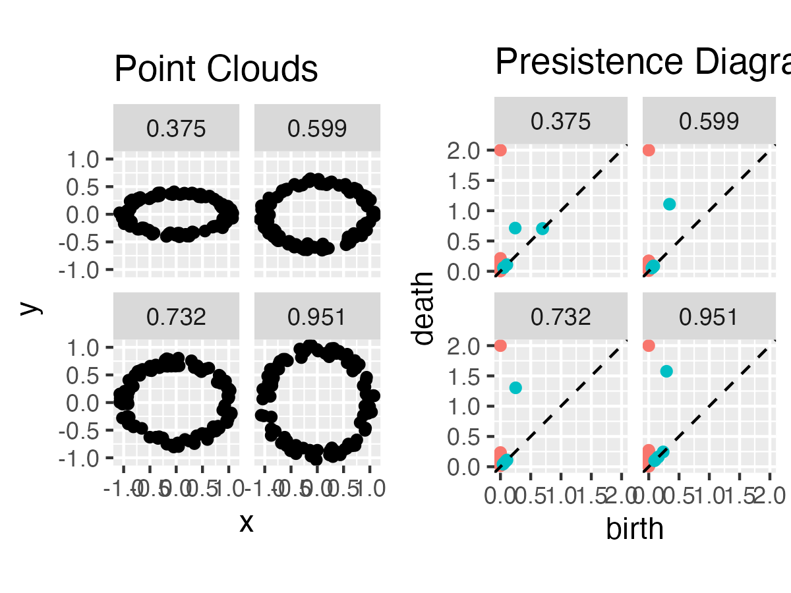
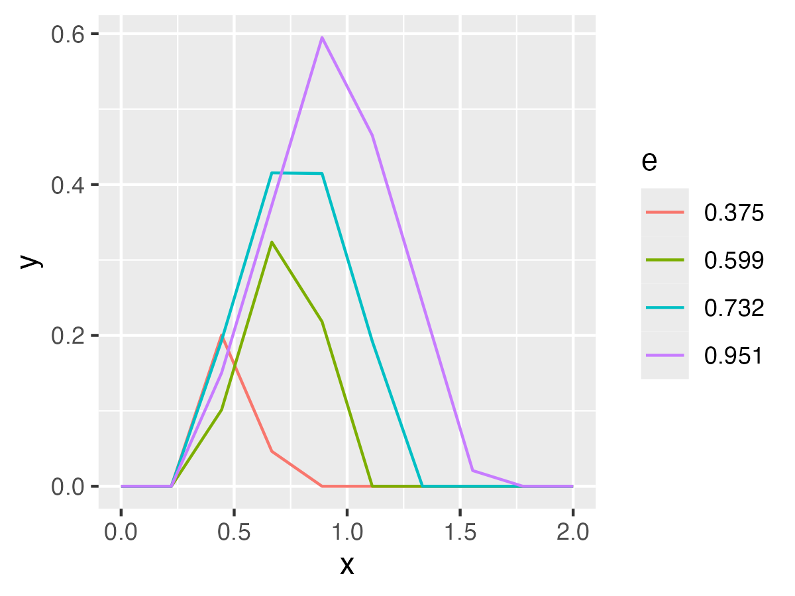
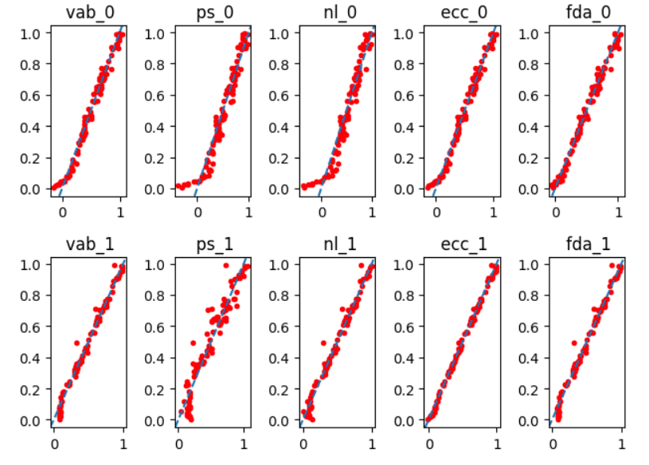

# Summary

The theory of \emph{persistent homology} is one of the popular tools in \emph{topological data analysis} (TDA) to analyze data with underlying shape structure [@Carlsson:2009; @edelsbrunner2010computational; @chazal2021introduction]. In this context, a single data observation could be a collection of points lying in a metric space, an image, a graph or a time series. The basic idea behind persistent homology is to build a nested sequence (or \emph{filtration}) of \emph{simplicial complexes} (indexed by a scale parameter) on top of data points and keep a record of the appearance and disappearance of various topological features at different scale values. Here, these topological features are "holes" of different dimensions -- connected components, loops, voids, and their higher-dimensional versions whose emergence and subsequent disappearance are tracked using a concept of homology from algebraic topology. From a geometric point of view, simplicial complexes consist of vertices, edges, triangles, tetrahedra etc., glued together and serve as a means for recovering (at least partially) the underlying shape information which is lost during sampling [@nanda2013simplicial].

A topological descriptor outputted by the persistent homology encoding the shape of data is called a \emph{persistence diagram} (PD). Mathematically, a $k$-dimensional PD is a multi-set of points $D=\{(b_i,d_i)\}_{i=1}^N$, where each point $(b_i,d_i)$ corresponds to a topological feature of homological dimension $k$ (0 if a connected component, 1 if a loop, 2 if a void, etc) with the $x$-coordinate representing the scale at which this feature is born (or created), and the $y$-coordinate representing the scale at which it dies (or disappears). In practice, one is usually interested in applying a machine learning method to PDs to make further inferences from data. However, the fact that PDs do not form a Hilbert space, which is a feature (or an input) space for a wide class of machine learning methods, limits their direct of use in applications. To overcome this challenge, kernel methods and vectorization techniques are commonly used [@chung2022persistence]. The kernel approach involves defining a notion of similarity between pairs of PDs, whereas the vectorization methods aim to transform PDs into finite-dimensional feature vectors that can be used as input for many standard machine learning models. Such vector summaries of PDs are computed in two steps: first one constructs a respective summary function from a given PD and then vectorizes it using either one or two dimensional grid of scale values. In recent years, the kernel and vectorization approaches have proven successful and gained  prominence in the applied TDA literature (see @hensel2021survey for a survey of applications of TDA in machine learning).   

### R tools for TDA

The computational tools for TDA in the \texttt{R} environment are provided through various packages\footnote{In this section, we only focus on \texttt{R} packages for TDA that are available on the CRAN repository.} such as \texttt{TDA} [@TDA], \texttt{TDAstats} [@wadhwa2018tdastats], \texttt{kernelTDA} [@kernelTDA], \texttt{TDAmapper} [@TDAmapper], \texttt{TDAkit} [@TDAkit], \texttt{tdaunif} [@tdaunif], \texttt{TDApplied} [@TDApplied] and \texttt{ripserr} [@ripserr] (see Table \ref{tab:TDA_packages} for an overview of these packages in terms of their scope and areas of focus). 

\newcommand{\cm}{$\checkmark$}

\newcommand{\rota}[1]{\rotatebox{90}{\texttt{#1}}}

\begin{table}[htbp]
  \centering
  \begin{tabular}{|l|c|c|c|c|c|c|c|c||c|c|c|c|}
    \hline
    & \multicolumn{8}{c||}{R libraries} & \multicolumn{4}{c|}{Python} \\
    \hline
    & \rota{TDA} & \rota{TDApplied} & \rota{TDAstats} & \rota{TDAkit} & \rota{kernelTDA} &  \rota{tdaunif} &\rota{ripserr} & \rota{TDAmapper} & 
        \rota{Giotto-tda} &  \rota{Gudhi} &  \rota{Dionysus 2} & \rota{scikit-tda}\\
    \hline
    Sampling methods & \cm & & &\cm & & \cm& & &
      & & & \\
    \hline
    Density estimation & \cm & & & & & & & &
       & \cm & & \\
    \hline
    Alpha filtration & \cm & & & & & & & &
       & \cm & & \cm \\
    \hline
    Alpha shape filtration &\cm & & & & & & & &
       & & & \\
    \hline
    Vietoris-Rips filtration &\cm & &\cm &\cm & & & \cm& &
       & \cm & \cm & \cm \\
    \hline
    User-defined filtration &\cm & & & & & & & &
       & & & \\
    \hline
    Cubical complex & & & & & & & \cm & &
      \cm  & \cm & & \\
    \hline
    Wasserstein distance &\cm &\cm &\cm & & \cm & & & &
      \cm  & \cm & \cm & \cm \\
    \hline
    Plotting persistence diagrams &\cm &\cm &\cm &\cm & & & & &
      \cm  & \cm & \cm & \cm \\
    \hline
    Statistical methods &\cm &\cm &\cm &\cm & & & & &
       & & & \\
    \hline
    Vectorization methods &\cm & & &\cm & \cm & & & &
       & & & \\
    \hline
    Kernel methods & &\cm & &\cm & \cm & & & &
       & & & \\
    \hline
    Supervised learning methods & &\cm & & & \cm & & & &
       & & & \\
    \hline
    Clustering methods &\cm &\cm & & \cm& & & & &
      \cm  & \cm & & \\
    \hline
    HD data plots & & & & & & & & \cm &
     \cm   & \cm & \cm & \\
    \hline
    Dimension reduction & &\cm & & & & & & &
       & & & \cm \\
    \hline
  \end{tabular}
  \caption{\texttt{R} and \texttt{Python} packages for TDA}
  \label{tab:TDA_packages}
\end{table}

The \texttt{TDA} package is the largest \texttt{R} package for TDA. The \texttt{TDA} package offers tools to compute PDs for commonly used types of filtrations such as \emph{Vietoris-Rips}, \emph{Alpha} and \emph{Alpha shape}. It also allows to construct more general sublevel set filtrations and compute the corresponding PDs. Moreover, the \texttt{TDA} package provides implementations to plot PDs and compute \emph{bottleneck and Wasserstein} distances between them. \texttt{TDAstats} offers a variety of tools for conducting statistical inference (such as hypothesis testing) on PDs. Compared to the \texttt{TDA} package, it computes PDs much faster for Vietoris-Rips filtrations based on the Ripser C++ library [@Bauer2021Ripser] and offers more aesthetic visualization of the diagrams using the \texttt{ggplot2} package [@ggplot2]. The \texttt{kernelTDA} package contains implementations of popular kernel-based methods for TDA such as \emph{geodesic Gaussian kernel}, \emph{geodesic Laplacian kernel}, \emph{persistence Fisher kernel} and \emph{persistence sliced Wasserstein kernel}. For computing the Wasserstein distance between a pair of PDs, unlike the \texttt{TDA} package, it uses an iterative procedure to reasonably approximate the exact distance which that leads to a considerable reduction in run-time cost. The \texttt{ripserr} package allows a fast computation of PDs for filtrations on Vietoris-Rips and cubical complexes using the Ripser C++ library. The \texttt{TDApplied} and \texttt{TDAkit} packages provides various tools to integrate topological features (PDs or their vector summaries) into machine and statistical learning settings. The \texttt{tdaunif} is a useful package if one needs to sample points from various manifolds such as a klein-bottle, an ellipse or a torus. \texttt{TDAmapper} offers tools to visualize high-dimensional data by constructing the so-called Mapper graphs that preserve its topological structure.

### Python tools for TDA

Several \texttt{Python} libraries are available for TDA, such as \texttt{Giotto-tda} [@tauzin2021giotto], \texttt{Ripser} [@christopher2018lean], \texttt{Gudhi} [@rouvreau2020gudhi], \texttt{Dionysus 2} [@Dionysus2], \texttt{Scikit-tda} [@scikittda2019] which is a container library for such projects as  \texttt{Ripser}, \texttt{Persim} [@Persim],  \texttt{KeplerMapper} [@van2019kepler], etc. \texttt{Giotto-tda} is a powerful library that integrates with the popular machine learning library \texttt{scikit-learn}, offering tools for persistent homology and visualizations of persistence diagrams. \texttt{Ripser} focuses on fast computation of Vietoris-Rips complexes, especially for large datasets. \texttt{Gudhi} provides a wide range of topological tools for simplicial complexes, persistent homology, and topological signatures. \texttt{Dionysus 2} offers fast computation of persistent homology and cohomology, with an emphasis on flexibility and efficiency. \texttt{Persim} focuses on tools for working with PDs. It contains implementations of commonly used vectorization and kernel methods for PDs. \texttt{KeplerMapper} implements the TDA Mapper algorithm to visualize high-dimensional data. \texttt{Scikit-tda} is another package that integrates with \texttt{scikit-learn}, simplifying the application of TDA to typical machine learning tasks. 

For a more comprehensive list of \texttt{Python} libraries for TDA and their functionality, we refer the readers to [@awesome-tda:2024].

The rest of the paper is organized as follows. In the next section we describe in more details our package and prove its necessity. Session 3 shows some usage examples and the last section is reserved for discussion. In the appendix you will find definitions of all used in our work vectorization summaries.

# Statement of need

As it was mentioned in the previous section, vectorization step is extremely important to include TDA in the ML pipeline. Up to now lots of different vectorization methods were proposed (see the Appendix below for short description of some of the existing ones). It turns out that performance accuracy of the ML algorithms depends strongly on the choice of the used vectorization, so it could be very interesting to be able to compare different approaches.

In order to do such a comparison it would be useful to have all considered vectorization methods implemented in one package in the uniform manner. Unfortunately, up to now such a package does not exist. Some mentioned in the Introduction libraries do have implementation of some of the vectorization (see table \ref{tab:vects} for quick comparison), but there is no ackage combining all of them together. More over, in R all the code behind the existing vector implementation is written using standard R factions, which may prove slow and inefficient in large-scale computations. In addition, the interfaces of various factions in different packages are not compatible with each other, which makes the comparison even more chalenging.

\begin{table}[htbp]
  \centering
  \begin{tabular}{|l|c|c|c|c|c||c|c|c|}
    \hline
    & \multicolumn{5}{c||}{R libraries} & \multicolumn{3}{c|}{Python} \\
    \hline
    & \rota{TDA} & \rota{TDApplied} & \rota{TDAstats} & \rota{TDAkit} & \rota{kernelTDA} &   
        \rota{Giotto-tda} &  \rota{Gudhi} &  \rota{scikit-tda}\\
    \hline
    Bar Codes                   & \cm & \cm & \cm & \cm &     &     &     &      \\
    Persistence Landscape       & \cm &     &     & \cm &     & \cm & \cm &  \cm \\
    Persistence Silhouette      & \cm &     &     & \cm &     & \cm & \cm &      \\
    Persistent Entropy Summary  &     &     &     &     &     &     & \cm &      \\
    Betti Curve                 &     &     &     &     &     & \cm & \cm &      \\
    Euler characteristic curve  &     &     &     &     &     &     &     &      \\
    The normalized life curve   &     &     &     &     &     &     &     &      \\
    Persistence Surface         &     &     &     &     & \cm & \cm & \cm &  \cm \\
    Persistence Block           &     &     &     &     &     &     &     &      \\
    \hline
    \end{tabular}
  \caption{Vectorizaions in different TDA packages}
  \label{tab:vects}

\end{table}

The TDArea R package and its Python counterpart aim to fill these gaps. Its contributions can be summarized as following:

1. It expands the list of implemented vector summaries of PDs by providing vectorization of eight functional summaries found in the TDA literature: \emph{Betti function}, \emph{persistence landscape function}, \emph{persistence silhouette function}, \emph{persistent entropy summary function} [@atienza2020stability], \emph{Euler characteristic curve} [@richardson2014efficient], \emph{normalized life curve} [@chung2022persistence], \emph{persistence surface} [@adams2017persistence] and \emph{persistence block} [@chan2022computationally] (see the Appendix for their definitions).

2. A univariate summary function $f$ of a PD is typically vectorized by evaluating it at each point of a superimposed one dimensional grid and arranging the resulting values into a vector:
\begin{equation}\label{stand_vec}
		(f(t_1),f(t_2),\ldots,f(t_n))\in\mathbb{R}^n,
\end{equation}
where $t_1,t_2,\ldots,t_n$ form an increasing sequence of scale values. For example, the \texttt{landscape()} and \texttt{silhouette()} functions of the \texttt{TDA} package compute vector summaries of persistence landscapes and silhouettes in this manner. The \texttt{TDAvec} package instead employs a different vectorization scheme which involves computing the average values of $f$ between two consecutive scale values $t_i$ and $t_{i+1}$ using integration: 
\begin{equation} 
	\Big(\frac{1}{\Delta t_1}\int_{t_1}^{t_2}f(t)dt,\frac{1}{\Delta t_2}\int_{t_2}^{t_3}f(t)dt,\ldots,\frac{1}{\Delta t_{n-1}}\int_{t_{n-1}}^{t_n}f(t)dt\Big)\in\mathbb{R}^{n-1}, 
\end{equation}
where $\Delta t_i=t_{i+1}-t_i$. Unlike (\ref{stand_vec}), this vectorization method does not miss the behavior of $f$ between neighboring scale points and applies to all univariate summary functions which are easy to integrate, namely persistence silhouette, persistent entropy summary function, Euler characteristic curve, normalized life curve and Betti function. 

3. To achieve higher computational efficiency, all code behind the vector summaries of \texttt{TDAvec} is written in C++. For example, in \texttt{R}, computing the persistence landscape from a PD with the \texttt{TDAvec} package is more than 200 times faster than with the \texttt{TDA} package.

The \texttt{TDAvec} \texttt{R} package and a vignette showing its basic usage with examples are available on the CRAN repository\footnote{https://cran.r-project.org/web/packages/TDAvec/index.html}. For \texttt{Python} examples, we refer the readers to sample notebook presented in [@pyTDAvec:2024]. 

# Usage Examples

Let us first describe how the R library TDAvec can be installed and used.

The current version of this library is available on CRAN, so the simplest way to install it is by using the standard R method:

    > install.packages("TDAvec")

Alternatively you can install it from the GitHub repository:

    > devtools::install_github("ALuchinsky/tdavec")

After downloading the library, you can use functions such as computePL, computePS, etc., to calculate the corresponding vectorization summaries of persistence diagrams.

Suppose we have a random set of squeeze factors $e^a \in [0,1]$, and for each of them, we create a cloud of points located around an ellipse:$$
(x_i, y_i)^a = ( r_i \cos\phi_i, e^a r_i\sin\phi_i)
$$
Here are R commands to reate the point clouds:

    > epsList <- round(as.vector(read.csv("./epsList.csv", header = FALSE))[[1]], 3)
    > clouds <- lapply(epsList, function(e) createEllipse(100, a=1, b=e))
    > PDs <- lapply(1:length(clouds), function(i) 
           ripsDiag(clouds[[i]], maxdimension = 1, maxscale = 2)$diagram
        )
In the figure figure \autoref{fig:XandPDs} below you can see examples of the created data.

Created point clouds can be converted into persistence diagrams using such functions as `ripsDiag` from `TDA` package. Each of the for each of the diagrams we can calculate Persistence Landscape summary with the help of `computePL(diagram, homDim, x)` function. In figure \autoref{fig:PLs} you can see the result.

The python interface of `TDAvec` library can be installed from the GitHub repository

    > pip install git+https://github.com/ALuchinsky/tdavec

Note that it was tested on Python 3.11 and uses numpy (vesrion numpy==1.2) and ripser (version 0.6.8) libraries.

You can directly access all available in R interface unctions of the package, like `computePL`, etc. In addition, python implementation follows the scikit-learn interface, so it uses a class-oriented approach. After installing the library, you can load all the objects with:

    > from tdavec.TDAvectorizer import TDAvectorizer, createEllipse

You can now use an object of the class TDAvectorizer to create persistence diagrams and vectorize them. Here is an example of Python code that performs the same job as the R commands above:

    > epsList = np.random.uniform(low = 0, high = 1, size = 500)
    > clouds = [createEllipse(a=1, b=eps, n=100) for eps in epsList]
    > v = TDAvectorizer()
    > v.fit(clouds)

The last line effectively uses the ripser library to convert data point clouds into a list of persistence diagrams, and the results will be saved in the v.diags property of the vectorizer object. To perform vectorization, we can simply call the fit() method of the same object:

    > v.setParams({"scale":np.linspace(0, 2, 10)})
    > X = v.transform(output="PL", homDim=1)

Note that the scale sequence (i.e., grid points for persistence landscape calculation) is specified in the first line. The type of vectorization summary can be specified as a parameter. This approach makes it extremely convenient to easily switch between methods in the analysis and assess accuracy. Here's how we can conduct such an analysis.

First, we define a helper function that vectorizes persistence diagrams using the specified method, builds a linear regression model based on the obtained predictors, and reports accuracies on the training and testing subsets:

    > def makeSim(method, homDim, vec = v, y=epsList):
    >    X =v.transform(output=method, homDim=homDim)
    >    Xtrain, Xtest, ytrain, ytest = train_test_split(X, y, train_size=0.8, random_state=42)
    >    model = LinearRegression().fit(Xtrain, ytrain)
    >    test_preds = model.predict(Xtest)
    >    score = model.score(Xtest, ytest)
    >    res = {"method":method, "homDim":homDim, "test_preds":test_preds, "y_test":ytest, "score":score}
    >    return res

Now we can use this function to collect data, construct accuracy tables, and compare true values and model predictions for each vectorization method:

    > methodList = ["vab", "ps", "nl", "ecc", "fda"]
    > df = pd.DataFrame()
    > for homDim in [0, 1]:
    >    for method in methodList:
    >    df = pd.concat([df, pd.DataFrame( makeSim(method, homDim))])

Using the created data frame, we can easily compare performance accuracies (see table below). It's also simple to check the accuracy of the models by inspecting true vs. predicted scatter plots (see figure).

\begin{table}[htbp]
  \centering
  \begin{tabular}{lrr}
   \hline
   Method & dim 0 & dim 1 \\
   \hline
   ecc & 0.976 & 0.996 \\
   fda & 0.983 & 0.985 \\
   NL & 0.8930 & 0.980 \\
   PS & 0.903 & 0.914 \\
   VAB & 0.976 & 0.985 \\
   \hline
  \end{tabular}
\end{table}

# Conclusion

# Appendix: Definitions of the summary functions in \texttt{TDAvec}

Let $D=\{(b_i,d_i)\}_{i=1}^N$ be a persistence diagram. 

1) _The $k$th order persistence landscape function_ of $D$ is defined as $$\lambda_k(t) = k\hbox{max}_{1\leq i \leq N} \Lambda_i(t), \quad k\in N,$$
where $k\hbox{max}$ returns the $k$th largest value and 
$$\Lambda_i(t) = \left\{
        \begin{array}{ll}
            t-b_i & \quad t\in [b_i,\frac{b_i+d_i}{2}] \\
            d_i-t & \quad t\in (\frac{b_i+d_i}{2},d_i]\\
            0 & \quad \hbox{otherwise}
        \end{array}
    \right.$$

2) _The $p$th power persistence silhouette function_:
$$\phi_p(t) = \frac{\sum_{i=1}^N |d_i-b_i|^p\Lambda_i(t)}{\sum_{i=1}^N |d_i-b_i|^p},$$
where
$$\Lambda_i(t) = \left\{
        \begin{array}{ll}
            t-b_i & \quad t\in [b_i,\frac{b_i+d_i}{2}] \\
            d_i-t & \quad t\in (\frac{b_i+d_i}{2},d_i]\\
            0 & \quad \hbox{otherwise}
        \end{array}
    \right.$$

3) _The persistent entropy summary function_:
$$
S(t)=-\sum_{i=1}^N \frac{l_i}{L}\log_2{(\frac{l_i}{L}})\mathbf 1_{[b_i,d_i]}(t),
$$ where $l_i=d_i-b_i$ and $L=\sum_{i=1}^Nl_i$.

4) _The Betti Curve_: 
$$
\beta(t)=\sum_{i=1}^N w(b_i,d_i)\mathbf 1_{[b_i,d_i)}(t),
$$ where the weight function $w(b,d)\equiv 1$.

5) _The Euler characteristic curve_: 
$$
\chi(t)=\sum_{k=0}^d (-1)^k\beta_k(t),
$$ where $\beta_0,\beta_1,\ldots,\beta_d$ are the Betti curves corresponding to persistence diagrams $D_0,D_1,\ldots,D_d$ of dimensions $0,1,\ldots,d$ respectively, all computed from the same filtration.

6) _The normalized life curve_: 
$$
sl(t)=\sum_{i=1}^N \frac{d_i-b_i}{L}\mathbf{1}_{[b_i,d_i)}(t),
$$ where $L=\sum_{i=1}^N (d_i-b_i)$.

7) _Persistence Surface_:
$$\rho(x,y)=\sum_{i=1}^N f(b_i,p_i)\phi_{(b_i,p_i)}(x,y),$$ where $\phi_{(b_i,p_i)}(x,y)$ is 
the Gaussian distribution with mean $(b_i,p_i)$ and 
covariance matrix $\sigma^2 I_{2\times 2}$ and 
$$
f(b,p) = w(p)=\left\{
        \begin{array}{ll}
            0 & \quad p\leq 0 \\
            p/p_{max} & \quad 0<p<p_{max}\\
            1& \quad p\geq p_{max}
        \end{array}
    \right.
$$
is the weighting function with $p_{max}$ being the maximum persistence value among all persistence diagrams considered in the experiment.

8) _The persistence block_:

$$
f(x,y)=\sum_{i=1}^N \mathbf 1_{E(b_i,p_i)}(x,y),
$$
where $E(b_i,p_i)=[b_i-\frac{\lambda_i}{2},b_i+\frac{\lambda_i}{2}]\times [p_i-\frac{\lambda_i}{2},p_i+\frac{\lambda_i}{2}]$ and $\lambda_i=2\tau p_i$ with $\tau\in (0,1]$.

9) _Functional Data Analysis_:

The drawback of all listed above vectorization methods is that we have to choose some grid points on t axis or on $(b,p)$ plane to get the numeric array of predictors from the vectorized functions. An alternative approach is to select some set of basis functions $\xi_i(t)$ and expand the result of the vectoriztion (for example, Betti Curve) as a combination of them:
$$
g(t) = \sum_i I_{[b_i,d_i)]}(t) = \sum_k c_k \xi_k(t)
$$
The coefficiets $\{c_k\}$ will be predictors in this approach. It is clear for this type of selection we do not need to select arbitrary the grid points. In addition, it is more robust to small changes of the function $g(t)$ or, alternatively, to birth-death points in the persistence diagram.

# References
