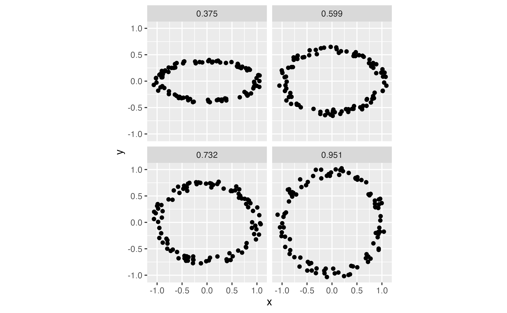
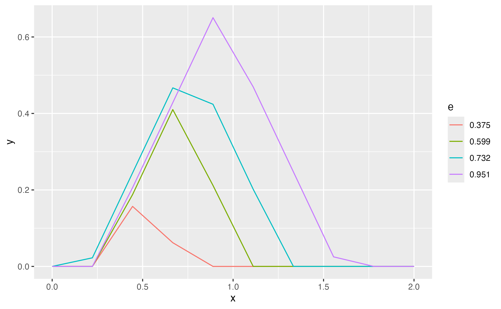

# Summary

The theory of \emph{persistent homology} is one of the popular tools in \emph{topological data analysis} (TDA) to analyze data with underlying shape structure [@Carlsson:2009; @edelsbrunner2010computational; @chazal2021introduction]. In this context, a single data observation could be a collection of points lying in a metric space, an image, a graph or a time series. The basic idea behind persistent homology is to build a nested sequence (or \emph{filtration}) of \emph{simplicial complexes} (indexed by a scale parameter) on top of data points and keep a record of the appearance and disappearance of various topological features at different scale values. Here, these topological features are "holes" of different dimensions -- connected components, loops, voids, and their higher-dimensional versions whose emergence and subsequent disappearance are tracked using a concept of homology from algebraic topology. From a geometric point of view, simplicial complexes consist of vertices, edges, triangles, tetrahedra etc., glued together and serve as a means for recovering (at least partially) the underlying shape information which is lost during sampling [@nanda2013simplicial].

A topological descriptor outputted by the persistent homology encoding the shape of data is called a \emph{persistence diagram} (PD). Mathematically, a $k$-dimensional PD is a multi-set of points $D=\{(b_i,d_i)\}_{i=1}^N$, where each point $(b_i,d_i)$ corresponds to a topological feature of homological dimension $k$ (0 if a connected component, 1 if a loop, 2 if a void, etc) with the $x$-coordinate representing the scale at which this feature is born (or created), and the $y$-coordinate representing the scale at which it dies (or disappears). In practice, one is usually interested in applying a machine learning method to PDs to make further inferences from data. However, the fact that PDs do not form a Hilbert space, which is a feature (or an input) space for a wide class of machine learning methods, limits their direct of use in applications. To overcome this challenge, kernel methods and vectorization techniques are commonly used [@chung2022persistence]. The kernel approach involves defining a notion of similarity between pairs of PDs, whereas the vectorization methods aim to transform PDs into finite-dimensional feature vectors that can be used as input for many standard machine learning models. Such vector summaries of PDs are computed in two steps: first one constructs a respective summary function from a given PD and then vectorizes it using either one or two dimensional grid of scale values. In recent years, the kernel and vectorization approaches have proven successful and gained  prominence in the applied TDA literature (see @hensel2021survey for a survey of applications of TDA in machine learning).   

The computational tools for TDA in R environments are provided through various packages, such as \texttt{TDA} [@TDA], \texttt{TDAstats} [@wadhwa2018tdastats], \texttt{kernelTDA} [@kernelTDA], \texttt{TDAmapper} [@TDAmapper], \texttt{TDAkit} [@TDAkit], \texttt{tdaunif} [@tdaunif], \texttt{TDApplied} [@TDApplied] and \texttt{ripserr} [@ripserr]. All of these packages provide different convenient functions for persistence diagram creation, visualization, analysis, etc. Some of them can also be used to calculate vectorization summaries of the created persistence diagrams, but the range of implemented methods for each of the packages is limited (see table). The same is true for python packages, such as \texttt{Giotto-tda} [@tauzin2021giotto], \texttt{Ripser} [@christopher2018lean], \texttt{Gudhi} [@rouvreau2020gudhi], \texttt{Dionysus 2} [@Dionysus2], \texttt{Scikit-tda} [@scikittda2019] which is a container library for such projects as  \texttt{Ripser}, \texttt{Persim} [@Persim], \texttt{KeplerMapper} [@van2019kepler]

Presented in this article TDAvec package combines together all Known up to now vectorizations in one framework.

The rest of the paper is organized as follows. In the next section we describe in more details our package and prove its necessity. Session 3 shows some usage examples and the last section is reserved for discussion. In the appendix you will find definitions of all used in our work vectorization summaries.

\newcommand{\cm}{$\checkmark$}

\newcommand{\rota}[1]{\rotatebox{90}{\texttt{#1}}}

\begin{table}[htbp]
  \centering
  \begin{tabular}{|l|c|c|c|c|c|c|c|c||c|c|c|c|}
    \hline
    & \multicolumn{8}{c||}{R libraries} & \multicolumn{4}{c|}{Python} \\
    \hline
    & \rota{TDA} & \rota{TDApplied} & \rota{TDAstats} & \rota{TDAkit} & \rota{kernelTDA} &  \rota{tdaunif} &\rota{ripserr} & \rota{TDAmapper} & 
        \rota{Giotto-tda} &  \rota{Gudhi} &  \rota{Dionysus 2} & \rota{scikit-tda}\\
    \hline
    Bar Codes                   & \cm & \cm & \cm & \cm &     &     &     &     &     &     &     &      \\
    Persistence Landscape       & \cm &     &     & \cm &     &     &     &     & \cm & \cm &     &  \cm \\
    Persistence Silhouette      & \cm &     &     & \cm &     &     &     &     & \cm & \cm &     &      \\
    Persistent Entropy Summary  &     &     &     &     &     &     &     &     &     & \cm &     &      \\
    Betti Curve                 &     &     &     &     &     &     &     &     & \cm & \cm &     &      \\
    Euler characteristic curve  &     &     &     &     &     &     &     &     &     &     &     &      \\
    The normalized life curve   &     &     &     &     &     &     &     &     &     &     &     &      \\
    Persistence Surface         &     &     &     &     & \cm &     &     &     & \cm & \cm &     &  \cm \\
    Persistence Block           &     &     &     &     &     &     &     &     &     &     &     &      \\
    \hline
    \end{tabular}
\end{table}

# Usage Examples

Let us first diescribe how R library `TDAvec` can be installed and used.

Current version of this library is available on CRAN, so simplet version to install it is to use standard R way:

    > install.packages("TDAvec")

After downloading the library you can use functions such functions as `computePL`, `computePS`, etc to calculate the corresponding vectorization summaries of the presistance diagrams.

Suppose that we have some random set of squeze factors $e^a \in [0;1]$ and for each o them we create a cloud of points located around the ellipse
$$
(x_i, y_i)^a = ( r_i \cos\phi_i, e^a r_i\sin\phi_i
$$
In the figure figure \autoref{fig:clouds} below you can see examples of the created point clouds.

Created point clouds can be converted into persistence diagrams using such functions as `ripsDiag` from `TDA` package. Each of the for each of the diagrams we can calculatr Persistence Landscape suppary with the help of `computePL(diagram, homDim, x)` function. In figure \autoref{fig:PLs} you can see the result.

# Statement of need

As it was mentioned in the previous section, vectorization step is extremely important to include TDA in the ML pipeline. Up to now lots of different vectorization methods were proposed (see the Appendix below for short description of some of the existing ones). It turns out that performance accuracy of the ML algorithms depends strongly on the choice of the used vectorization, so it could be very interesting to be able to compare different approaches.

In order to do such a comparison it would be useful to have all considered vectorization methods implemented in one package in the uniform manner. Unfortunately, up to now such a package does not exist. all mentioned in the Introduction libraries do have implementation of some of the vectorizations (see table for quick comparison), but there is no ackage combining all of them together. More over, in R all the code behind the existing vector implementation is written using standard R factions, which may prove slow and inefficient in large-scale computations. In addition, the interfaces of various factions in different packages are not compatible with each other, which makes the comparison even more chalenging.

The TDArea R package and its Python counterpart aim to fill these gaps. Its contributions can be summarized as following:

1. It expands the list of implemented vector summaries of PDs by providing vectorizations of eight functional summaries found in the TDA literature: \emph{Betti function}, \emph{persistence landscape function}, \emph{persistence silhouette function}, \emph{persistent entropy summary function} [@atienza2020stability], \emph{Euler characteristic curve} [@richardson2014efficient], \emph{normalized life curve} [@chung2022persistence], \emph{persistence surface} [@adams2017persistence] and \emph{persistence block} [@chan2022computationally] (see the Appendix for their definitions).

2. A univariate summary function $f$ of a PD is typically vectorized by evaluating it at each point of a superimposed one dimensional grid and arranging the resulting values into a vector:
\begin{equation}\label{stand_vec}
		(f(t_1),f(t_2),\ldots,f(t_n))\in\mathbb{R}^n,
\end{equation}
where $t_1,t_2,\ldots,t_n$ form an increasing sequence of scale values. For example, the \texttt{landscape()} and \texttt{silhouette()} functions of the \texttt{TDA} package compute vector summaries of persistence landscapes and silhouettes in this manner. The \texttt{TDAvec} package instead employs a different vectorization scheme which involves computing the average values of $f$ between two consecutive scale values $t_i$ and $t_{i+1}$ using integration: 
\begin{equation} 
	\Big(\frac{1}{\Delta t_1}\int_{t_1}^{t_2}f(t)dt,\frac{1}{\Delta t_2}\int_{t_2}^{t_3}f(t)dt,\ldots,\frac{1}{\Delta t_{n-1}}\int_{t_{n-1}}^{t_n}f(t)dt\Big)\in\mathbb{R}^{n-1}, 
\end{equation}
where $\Delta t_i=t_{i+1}-t_i$. Unlike (\ref{stand_vec}), this vectorization method does not miss the behavior of $f$ between neighboring scale points and applies to all univariate summary functions which are easy to integrate, namely persistence silhouette, persistent entropy summary function, Euler characteristic curve, normalized life curve and Betti function. 

3. To achieve higher computational efficiency, all code behind the vector summaries of \texttt{TDAvec} is written in C++. For example, in \texttt{R}, computing the persistence landscape from a PD with the \texttt{TDAvec} package is more than 200 times faster than with the \texttt{TDA} package.

The \texttt{TDAvec} \texttt{R} package and a vignette showing its basic usage with examples are available on the CRAN repository\footnote{https://cran.r-project.org/web/packages/TDAvec/index.html}. For \texttt{Python} examples, we refer the readers to sample notebook presented in [@pyTDAvec:2024]. 

# Appendix: Definitions of the summary functions in \texttt{TDAvec}

Let $D=\{(b_i,d_i)\}_{i=1}^N$ be a persistence diagram. 

1) _The $k$th order persistence landscape function_ of $D$ is defined as $$\lambda_k(t) = k\hbox{max}_{1\leq i \leq N} \Lambda_i(t), \quad k\in N,$$
where $k\hbox{max}$ returns the $k$th largest value and 
$$\Lambda_i(t) = \left\{
        \begin{array}{ll}
            t-b_i & \quad t\in [b_i,\frac{b_i+d_i}{2}] \\
            d_i-t & \quad t\in (\frac{b_i+d_i}{2},d_i]\\
            0 & \quad \hbox{otherwise}
        \end{array}
    \right.$$

2) _The $p$th power persistence silhouette function_:
$$\phi_p(t) = \frac{\sum_{i=1}^N |d_i-b_i|^p\Lambda_i(t)}{\sum_{i=1}^N |d_i-b_i|^p},$$
where
$$\Lambda_i(t) = \left\{
        \begin{array}{ll}
            t-b_i & \quad t\in [b_i,\frac{b_i+d_i}{2}] \\
            d_i-t & \quad t\in (\frac{b_i+d_i}{2},d_i]\\
            0 & \quad \hbox{otherwise}
        \end{array}
    \right.$$

3) _The persistent entropy summary function_:
$$
S(t)=-\sum_{i=1}^N \frac{l_i}{L}\log_2{(\frac{l_i}{L}})\mathbf 1_{[b_i,d_i]}(t),
$$ where $l_i=d_i-b_i$ and $L=\sum_{i=1}^Nl_i$.

4) _The Betti Curve_: 
$$
\beta(t)=\sum_{i=1}^N w(b_i,d_i)\mathbf 1_{[b_i,d_i)}(t),
$$ where the weight function $w(b,d)\equiv 1$.

5) _The Euler characteristic curve_: 
$$
\chi(t)=\sum_{k=0}^d (-1)^k\beta_k(t),
$$ where $\beta_0,\beta_1,\ldots,\beta_d$ are the Betti curves corresponding to persistence diagrams $D_0,D_1,\ldots,D_d$ of dimensions $0,1,\ldots,d$ respectively, all computed from the same filtration.

6) _The normalized life curve_: 
$$
sl(t)=\sum_{i=1}^N \frac{d_i-b_i}{L}\mathbf{1}_{[b_i,d_i)}(t),
$$ where $L=\sum_{i=1}^N (d_i-b_i)$.

7) _Persistence Surface_:
$$\rho(x,y)=\sum_{i=1}^N f(b_i,p_i)\phi_{(b_i,p_i)}(x,y),$$ where $\phi_{(b_i,p_i)}(x,y)$ is 
the Gaussian distribution with mean $(b_i,p_i)$ and 
covariance matrix $\sigma^2 I_{2\times 2}$ and 
$$
f(b,p) = w(p)=\left\{
        \begin{array}{ll}
            0 & \quad p\leq 0 \\
            p/p_{max} & \quad 0<p<p_{max}\\
            1& \quad p\geq p_{max}
        \end{array}
    \right.
$$
is the weighting function with $p_{max}$ being the maximum persistence value among all persistence diagrams considered in the experiment.

8) _The persistence block_:
$$
f(x,y)=\sum_{i=1}^N \mathbf 1_{E(b_i,p_i)}(x,y),
$$
where $E(b_i,p_i)=[b_i-\frac{\lambda_i}{2},b_i+\frac{\lambda_i}{2}]\times [p_i-\frac{\lambda_i}{2},p_i+\frac{\lambda_i}{2}]$ and $\lambda_i=2\tau p_i$ with $\tau\in (0,1]$.

# References
